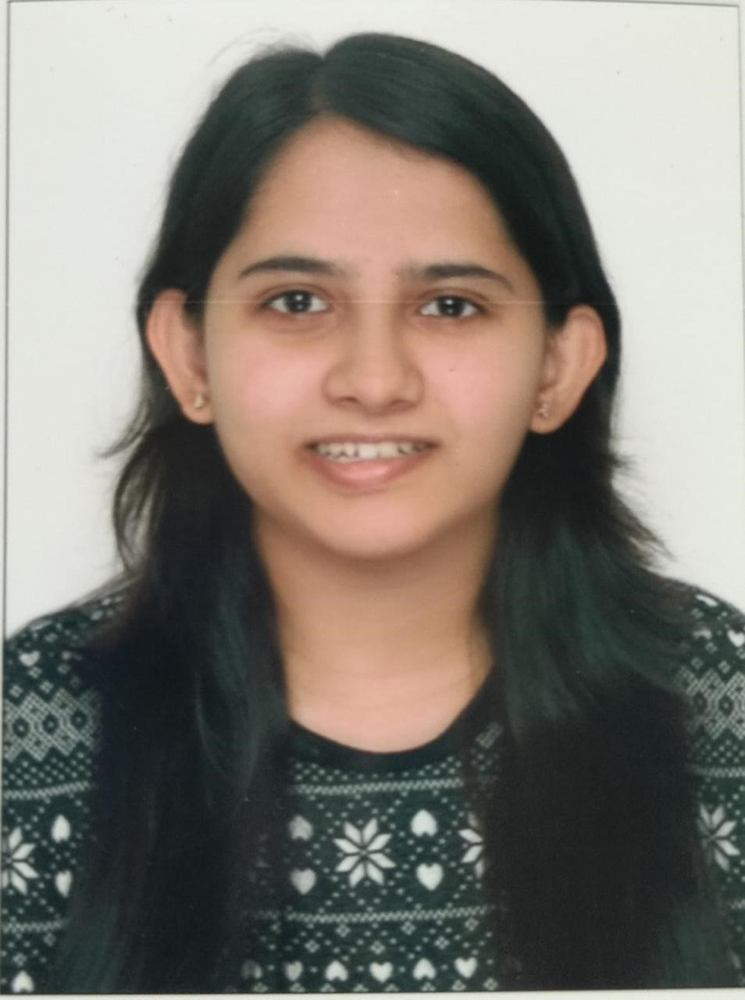

# cs7461-team29-mlProject

# Proposal Sections & Checklist

## Introduction/Background
Provide an introduction to your topic, including a brief literature review of related work. Explain your dataset and its features, and provide a link to the dataset if possible.

### ✅ Literature Review
- [Add your literature review here.]

### ✅ Dataset Description
- [Describe your dataset, including its features and significance.]

### ✅ Dataset Link (if applicable)
- [Provide the link to your dataset here.]

---

## Problem Definition
Identify a problem and motivate the need for a solution.

### ✅ Problem
- [Clearly define the problem you are addressing.]

### ✅ Motivation
- [Explain why this problem needs to be solved and its importance.]

---

## Methods
Present proposed solutions, including specific data processing methods and machine learning algorithms, elaborating on their effectiveness. Identify specific functions/classes in existing packages and libraries (e.g., scikit-learn) rather than coding the algorithms from scratch.

### ✅ 3+ Data Preprocessing Methods Identified
1. [Method 1: Description]
2. Method 2: Unsupervised Learning: We aim to utilize unsupervised machine learning algorithms for two main objectives:
   #### 1. Techniques used for: Team Clustering
      
      ##### K-means Clustering:
      - **Apply K-means to group teams based on their playing styles**: Teams are clustered by their statistical features (like goals scored, tackles, and possession), grouping teams with similar tactics into distinct clusters.
      
      - **Use the elbow method to determine the optimal number of clusters**: This method identifies the point where adding more clusters provides diminishing returns in reducing within-cluster variance, helping to find the most meaningful number of team groupings.
      
      - **Visualize clusters using t-SNE for dimensionality reduction**: t-SNE projects the high-dimensional team statistics into two dimensions, making it easier to visualize and interpret how teams are grouped by their playing styles.
      
      ##### Gaussian Mixture Models (GMM):
      - **Implement GMM as an alternative clustering method, allowing for more flexible cluster shapes**: Unlike K-means, GMM allows each team to belong to multiple clusters with different probabilities, accommodating more complex relationships between teams.
      
      - **Compare GMM results with K-means to identify consistent groupings**: By comparing the results of both methods, we can ensure that the clusters are reliable and stable across different approaches, giving deeper insights into team similarities.
      
      ##### Hierarchical Clustering:
      - **Perform agglomerative clustering to create a dendrogram of team similarities**: This method groups teams in a tree-like structure, making it easier to see how similar teams are to one another at different levels of granularity.
      
      - **Use this to identify both broad tactical families and subtle stylistic differences**: By analyzing the hierarchical tree, we can spot both large groupings of similar teams and more nuanced differences between closely related teams.
  
   #### 2. Techniques used for: Player-Team Compatibility Analysis
      ##### Similarity Metrics:
      - **Develop a cosine similarity measure between player attributes and team playing styles**: Cosine similarity will be used to quantify how closely a player's attributes (e.g., passing, shooting, defending) align with the tactical style of a team, allowing us to find players who fit the team's playing strategy.
        
      - **Create a compatibility score that considers both player skills and team tactical needs**: A weighted compatibility score will combine the cosine similarity of player attributes with specific team requirements, such as a need for strong defensive or offensive players, to ensure a more tailored fit for the team's tactical goals.
      
      ##### Optimization Algorithm:
      - **Implement a greedy algorithm to select the best players for a given team based on player-team style compatibility**: The greedy algorithm will iteratively pick the best available player for the team by maximizing the player-team compatibility score, ensuring that the players chosen complement the team’s tactical style.
      
      - **Player performance metrics**: The algorithm will factor in recent player performance data, such as goals scored or defensive actions, to prioritize high-performing players in key areas that the team requires.
      
      - **Positional needs of the team**: The selection will also account for the team’s positional needs, ensuring that the chosen players fill gaps in the lineup and balance the squad based on the team's formation and tactical approach.

4. Method 3: Integration of Supervised learning and Unsupervised learning
   

   We aim to utilize machine learning techniques for clustering teams based on playing style, selecting matchups between teams from different clusters, identifying optimal players for a given matchup, and predicting the outcome of the match using historical data. Develop a system by combining unsupervised learning (K-means clustering), supervised learning (Random Forest classifier), and heuristic methods (player selection based on opponent characteristics), which would offer a sophisticated approach to team and player analysis.
   

   
#### Steps:
1. Clustering Teams Based on Playing Style: We will first extract team playing style features from the available dataset, which may include:
   * **Offensive metrics**: Goals scored, shots on target, passing accuracy in the attacking third, etc.
   * **Defensive metrics**: Tackles made, interceptions, clearances, etc.
   * **Possession metrics**: Time in possession, passes completed, and ball retention.
   * **Form**: A measure of the team's performance in recent matches.         
      These features will be normalized using `StandardScaler` to ensure uniformity across different ranges of metrics. After normalizing the data, **K-means clustering** will be applied to group teams into clusters based on their playing style. The clustering result will provide a set of groups where each group (cluster) represents teams with similar playing styles.
     
2. Visualizing Clusters:To visualize the results, we will apply t-SNE (t-distributed stochastic neighbor embedding) to reduce the dimensionality of the playing style features, allowing us to plot teams in a 2D space. Each point will represent a team, and the color will represent its cluster.
3. Selecting Teams to Play Against Each Other: To ensure diversity in matchups, we will randomly select two teams from different clusters. This ensures that teams with varying playing styles are chosen for the simulated match.
4. Finding Best Players Based on Opponent: We will implement a system that identifies the best players for one team based on how well they can counter the playing style of the opposing team. This will involve comparing the playing styles of both teams and identifying which players from the opponent's squad are best suited to exploit the weaknesses of the first team.
  5. Predicting Match Outcome: Using historical match data, we will train a Random Forest classifier to predict the outcome of a match based on the playing styles (clusters) of both teams and their recent form. This will allow us to predict the likely outcome and the probabilities of each team winning.

#### Tools and Technologies:
   - 🐍 **Python Libraries**: Scikit-learn (for K-means clustering, t-SNE, Random Forest), Pandas, Matplotlib
   - 🤖 **Machine Learning Algorithms**: K-means clustering, t-SNE for visualization, Random Forest classifier for match prediction
   - 📊 **Data**: Team statistics (playing style), player statistics, and historical match data

### Supervised Learning
## Yay

---

## (Potential) Results and Discussion
Identify several quantitative metrics you plan to use for the project (i.e., ML Metrics). Present goals in terms of these metrics and state any expected results.

### ✅ 3+ Quantitative Metrics
1. [Metric 1: Description]
2. [Metric 2: Description]
3. [Metric 3: Description]

### ✅ Project Goals
- [Outline your project goals, including sustainability and ethical considerations.]

### ✅ Expected Results
- [Discuss the expected outcomes of your project.]

---

## References
Cite relevant papers and articles utilizing the IEEE format. Ensure that all references in this section have matching in-text citations in the body of your proposal text.

### ✅ 3+ References (preferably peer-reviewed)
1. [Reference 1]
2. [Reference 2]
3. [Reference 3]

### ✅ 1+ In-Text Citation Per Reference
- [Provide in-text citations as necessary.]

---

## Proposal Submission Requirements

1. **Gantt Chart**: List each member's planned responsibilities for the entirety of the project. Feel free to use the Fall and Spring semester sample Gantt Chart.
   - [Insert Gantt Chart here.]

2. **Contribution Table**: List all group members' names and explicit contributions in preparing the proposal using the format below.

| Name        | Proposal Contributions                  |
|-------------|-----------------------------------------|
| Member 1   | [Contributions]                        |
| Member 2   | [Contributions]                        |
| Member 3   | [Contributions]                        |

### Who Are We?

 

     
     
Tech enthusiast with a knack for solving real-world problems through innovative software and machine learning solutions.

 

 

     
     
Description for Team Member 2.

 

 

     
     
Description for Team Member 3.

 

